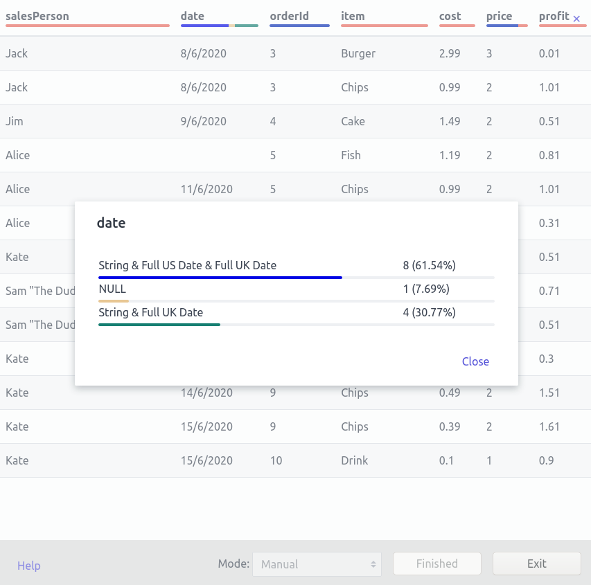
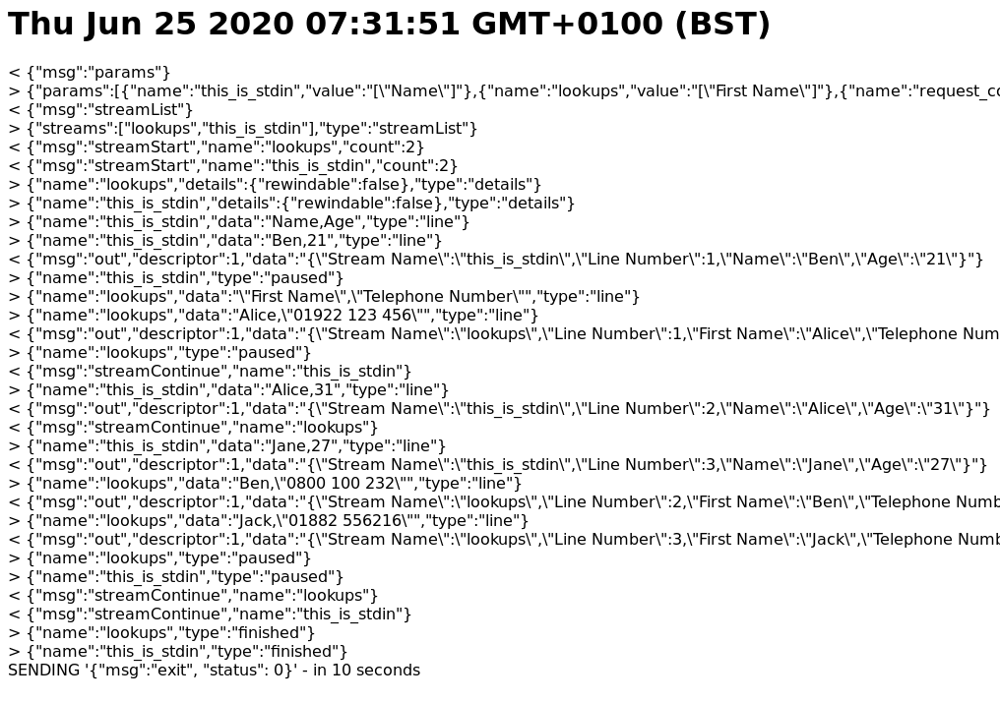

# WV Linewise

## The Potential User

You're a software developer and UNIX system administrator.

You loooove the command line.

You have probably looked at GNU Plot because it could draw graphs on the terminal but feel it's output isn't suitable for you.

Also you write your SQL in VIM and have it integrated with TMUX to send your query to `psql` you get mildly annoyed because of the lack of horizontal scrolling.

Maybe you use i3...

You write software for a living, sometimes you write great code. Your code is sometimes deployed into big integrated projects but sometimes it's only about getting data from A to B, a one off and while it works, you wonder if `BLAH BLAH | SOMETHING | X | jq BLAH | Y | Z` might have worked, and may have been faster if only you could add some interactivity to X.

You need one foot in both worlds... how...

## What it does

[Boscop's Web-View](https://github.com/Boscop/web-view) has provided us with a lightweight library for showing HTML/CSS/JS within a window, using the OS's standard browser. If you know HTML/CSS/JS but shudder at the weight of Electron, this may be your thing. As a bonus, it's written in Rust too!

This project provides some Rust functions for streaming STDIN or files into Boscop's Web-View and a higher level TypeScript / JavaScript API to pull them in as a stream of lines. You can also write to STDOUT using this API enabling you to put something like a web page, right in the middle of a UNIX pipeline. I find this quite exciting.

Can you think of any things which you would like to do using UNIX pipes which you think you may want to add some interactivity or graphics to? I can think of many...

## Example

This program could be invoked like the following:


    # Prepare lookups.csv
    echo '"First Name","Telephone Number"' > lookups.csv
    echo 'Alice,"01922 123 456"' >> lookups.csv
    echo 'Ben,"0800 100 232"' >> lookups.csv
    echo 'Jack,"01882 556216"' >> lookups.csv

    # write a file that we will pipe to stdin
    echo 'Name,Age' > stdin.csv
    echo 'Ben,21' >> stdin.csv
    echo 'Alice,31' >> stdin.csv
    echo 'Jane,27' >> stdin.csv

    cat stdin.csv | wv-linewise \
        --code join_csvs.html \
        --stream this_is_stdin=- \
        --stream lookups=lookups.csv
        --param this_is_stdin='["Name"]' \
        --param lookups='["First Name"]' \
        --param request_count=2


The data input above would cause the following messages to be sent between WV Linewise and the embedded web page.

    < { "msg": "params" }
    > { "type": "params", "params": [{ "name": "this_is_stdin", value: "[\"Name\"]"}, {"name": "lookups": "value": "[\"First Name\"]"}] }
    < {"msg":"streamList"}
    > {"streams":["this_is_stdin","lookups"],"type":"streamList"}
    < { "msg": "out", "descriptor": 1, "data": "Line Number,Name,Age,Telephone Number" }
    < { "msg": "streamStart", "name": "this_is_stdin", "count": 2 }
    < { "msg": "streamStart", "name": "lookups", "count": 2 }
    > { "type": "details", "name": "this_is_stdin", "details": { "rewindable": false }
    > { "type": "details", "name": "lookups", "details": { "rewindable": false }
    > { "type": "line", "name": "this_is_stdin", "data": "Name,Age" }
    > { "type": "line", "name": "this_is_stdin", "data": "Ben,21" }
    > { "type": "paused", "name": "this_is_stdin" }
    > { "type": "line", "name": "lookups", "data": "\"First Name\",\"Telephone Number\"" }
    < { "msg": "streamContinue", "name": "this_is_stdin" }
    > { "type": "line", "name": "lookups", "data": "Alice,\"01922 123 456\"" }
    > { "type": "paused", "name": "lookups" }
    > { "type": "line", "name": "this_is_stdin", "data": "Alice,31" }
    < { "msg": "out", "descriptor": 1, "data": "2,Alice,31,\"01922 123 456\"" }
    > { "type": "line", "name": "this_is_stdin", "data": "Jane,27" }
    > { "type": "finished", "name": "this_is_stdin" }
    < { "msg": "streamContinue", "name": "lookups" }
    > { "type": "line", "name": "lookups", "data": "Ben,\"0800 100 232\"" }
    < { "msg": "out", "descriptor": 1, "data": "1,Ben,21,\"0800 100 232"" }
    > { "type": "line", "name": "lookups", "data": "Jack,\"01882 556216\"" }
    > { "type": "finished", "name": "lookups" }
    < { "msg": "exit", "status": 0 }

NOTE: `<` are messages from TypeScript / JavaScript to WV Linewise, `>` are the responses.

WV Linewise will then exit with a status code of 0 and the following data will have already been written to STDOUT:

    Line Number,Name,Age,Telephone Number
    2,Alice,31,"01922 123 456"
    1,Ben,21,"0800 100 232"


## APIs

There are two TypeScript / JavaScript APIs I created to control the sending / receiving of messages. These are listed below:

### The original Light Wrapper API

If for whatever reason you don't want to use the Buffer API, the original API is a light weight message / event based API. In writing it I was merely trying to add some type safety over the raw messages. See the example below

```typescript
import { RawWvLinewise, WvLinewise, RESPONSE_TYPE, MessageErrorResponse, ErrorResponse, ParamsResponse, LineResponse, PausedResponse } from "wv-linewise-js-lib";

async function processLightWeight() {

let lineCount = 0;
const wvl: WvLinewise = new WvLinewise(new RawWvLinewise(external as any));

// Upon error, just raise it so it's caught by the global error handler.
wvl.on(RESPONSE_TYPE.MESSAGE_ERROR, (msg: MessageErrorResponse) => {
    throw new Error(`MSG ERROR: ${JSON.stringify(msg)}`)
});

// Upon error, just raise it so it's caught by the global error handler.
wvl.on(RESPONSE_TYPE.ERROR, (msg: ErrorResponse) => {
    throw new Error(`MSG ERROR: ${JSON.stringify(msg)}`)
});

// Request the parameters the user passed in on the command line
function getParams(wvl: WvLinewise): Promise<ParamsResponse> {
    return new Promise((resolve) => {
        let f = (resp: ParamsResponse) => {
            resolve(resp);
        };
        wvl.once(RESPONSE_TYPE.PARAMS, f);
        wvl.requestParams();
    });
}

function getRequestQuantity(paramsResponse: ParamsResponse): number {
    for (let p of paramsResponse.params) {
        if (p.name == "quantity") {
            return parseInt(p.value, 10);
        }
    }
    return 1000;
}

// Because all of our code is blocking (we're not waiting for animations etc)
// we're going to have processed the data immediately, so when WV Linewise
// pauses we can just start it right up again.
wvl.on(RESPONSE_TYPE.PAUSED, (resp: PausedResponse) => {
    if (resp.name == "in") {
        wvl.streamContinue("in");
    }
});

// This function will get fired on every line, with the line that came from
// the "in" stream, which could be STDIN or a file.
wvl.on(RESPONSE_TYPE.LINE, (resp: LineResponse) => {
    if (resp.name == "in") {
        lineCount = lineCount + 1;
    }
    document.body.innerText = `The file has ${lineCount} lines`
});


// Start WV Linewise processing lines
wvl.streamStart("in", getRequestQuantity(await getParams(wvl)));

}

processLightWeight();
```

### The buffer API

The WvLinewiseBuffer will allow you to disregard the messages for the purposes of reading the streams. It uses a low watermark and a quantity to request (3rd and 4th parameters) to try and make sure there's always lines available. Because it's built upon Promises it can handle situations where the buffer is empty and not fail.

```typescript
async function processBuffer(wvl: WvLinewise) {

    let buffer = new WvLinewiseBuffer(wvl, "in", 100, 200);
    let line: string|null = "";
    let lineCount = 0;

    while (line !== null) {
        line = await buffer.shift();
        if (line === null) {
            continue;
        }
        document.body.innerText = `The file has ${lineCount} lines and the last line was ${line}`;
    }
}

const wvl: WvLinewise = new WvLinewise(new RawWvLinewise(external as any));
processBuffer(wvl);
```

## Installation

Installation is possible with Rust v1.42.0 and later.

[RustUp](https://rustup.rs/) is how I installed Rust.

Once Rust is fully installed using `cargo install --path .` will compile and install the actual binary as wv_linewise.

## Example Applications

### [Discover Types](./examples/discover-types)

#### About
DiscoverTypes is an application for identifying the types of fields within a CSV file. It does this by comparing every cell against every regular expression the user has supplied. Because the CSV file could be HUGE it does not load the whole thing into memory but inspects it line by line as it passes through.

#### Screenshot



### [Display Messages](./examples/display-messages)

#### About

This is a pure vanilla JS application I used to see develop WV Linewise, it's super basic and only:

 * Outputs messages sent and received into the Web View.
 * Lines that are are received by the Web View are assumed to be CSV data, converted to JSON with the stream name and line number added then sent to STDOUT.

If you want to see how the interact with the original lightweight API this is probably the best place to start.

#### Screenshot



