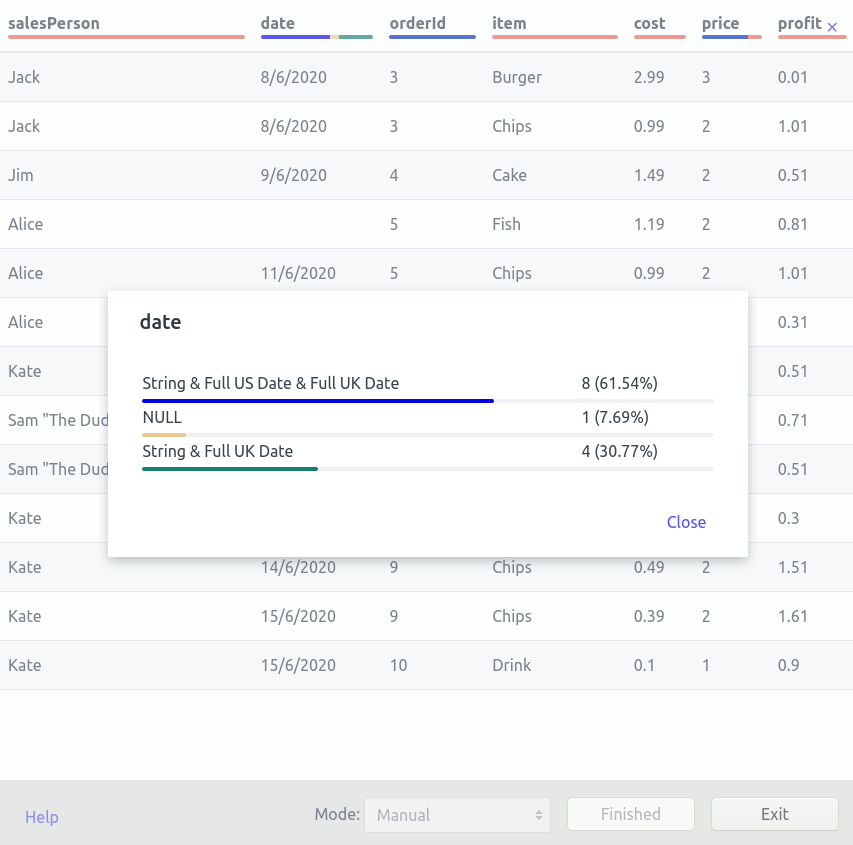

# Discover Types

## About

DiscoverTypes is an application for identifying the types of fields within a CSV file. It does this by comparing every cell against every regular expression the user has supplied. Because the CSV file could be HUGE it does not load the whole thing into memory but inspects it line by line as it passes through.

## Screenshot



## The Output

The following is an example of the CSV output:

| Column      | Types                                     | Count   | Total Record Count    |
| ------------|-------------------------------------------|---------|-----------------------|
| salesPerson | ["String"]"                               | 13      | 13                    |
| date        | ["String","Full US Date","Full UK Date"]" | 8       | 13                    |
| date        | ["NULL"]"                                 | 1       | 13                    |
| date        | ["String","Full UK Date"]"                | 4       | 13                    |
| orderId     | ["Integer","String"]"                     | 13      | 13                    |
| item        | ["String"]"                               | 13      | 13                    |
| cost        | ["String"]"                               | 13      | 13                    |
| price       | ["Integer","String"]"                     | 10      | 13                    |
| price       | ["String"]"                               | 3       | 13                    |
| profit      | ["String"]"                               | 13      | 13                    |

Every cell within a CSV could be interpreted as 0 or more different types. Generally speaking I would use the regular expression `^$` (meaning a zero length string) to be `NULL` and `.` (at least one character in length) to be a String. This means that the integer `4` might be an integer (`^\-[0-9]+`) but could also a string. This is completely correct as you might have user input of a string type, which users tend to write integers in, an example of this may be local phone numbers, which are often just numbers, but sometimes include other characters, so are forced to be strings.

### Why we don't prefer one type over another

Imagine you had 14 million lines and one column was full of dates and we preferred US dates format over the UK dates. The software would tell us we had 14 million (minus one) US dates and 1 UK date and you may conclude that the column is US dates with one error... but if all the dates were before the 12th of the month except __that__ one, you'd probably be wrong.

This situation is actually shown in a much more simple form above. You can see that the date column must be one of the following:

 * A "Full US Date" and therefore has 5 records in error.
 * A "String" and therefore has 1 record in error.
 * A "Full UK Date" and therefore has 1 record in error.
 * **A "String" with null allowed and therefore has 0 record in error.**
 * **A "Full UK Date" with null allowed and therefore has 0 record in error.**

Given the output above it should be relatively trivial to write software, to figure out that the date column is actually a UK Date which allows nulls. But the caveat is that software needs to know to prefer "Full UK Date" over "String" which this software does not.

I may well add code and columns to:

 * List out what the zero error candidates are. This would get you down to just "String" and "Full UK Date" in the above example.
 * Add at least one example for each row in the table above.

## Usage

```shell
cat test-data/burger-shop.csv | wv-linewise --code index.html \
  --stream in=- \
  --stream types=types.csv \
  --param 'Full US Date'='^0*[0-9][0-2]?/[0-9]+/[0-9]{4}$' \
  --param 'Full UK Date'='^[0-9]+/0*[0-9][0-2]?/[0-9]{4}$' \
  --param mode='continuous'
```

Because DiscoverTypes is built upon WV Linewise it's command line interface is the interface from WV Linewise... well I could wrap the program in a BASH/BAT file to make it more slick, but DiscoverTypes is actually only an example application for WV Linewise so I will not.

### The "in" stream ( required )

The "in" stream is where the actual CSV you want to inspect comes from. It could be huge...

If you use the special value `-` WV Linewise will read STDIN, otherwise this will be taken to be a filename and that file will be read.

### The "types" stream (optional)

The "type" stream is a CSV with the following structure.

| name    | regexp    |
|---------|-----------|
| Integer | ^-?[0-9]+ |
| String  | .         |
| NULL    | ^$        |

The `name` is a types name and `regexp` is a JavaScript regular expression without the enclosing forward slashes.

### The "type" parameters (optional)

The type parameters are added to the "types" stream above with the `name` and the `regexp` taking the same form. Because WV Linewise has a singular `--param` command line argument written in the form `--param 'name=value`, which is moderately too verbose but at least quite specific.

The name must not conflict with any other parameter names otherwise it will need to can be specified in full, for example such as `--param 'type=Full UK Date=^[0-9]+/0*[0-9][0-2]?/[0-9]{4}$'`. Type parameters names also cannot include the `=` symbol.

### The "mode" parameter (optional)

I think the ease of adding interactive elements within UNIX pipelines is one of the nicest parts of WV Linewise, but equally I would find it mildly annoying to page through over a million rows.

To deal with this I have introduced a "mode" to Discover Types which can take one of three values:

 * `manual` The default mode is "manual" and in this mode you will have to press "More" on the user interface to page through the data.
 * `continuous` This mode will page automatically and will stop at the end, waiting for you to press the "Exit" button,
 * `continuous-and-exit` This is same as `continuous` except that it exits automatically at the end.
